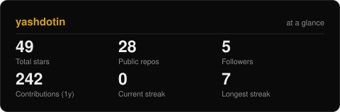
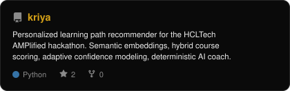
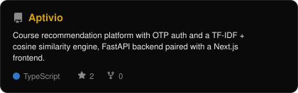
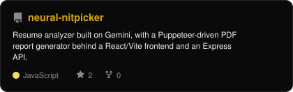
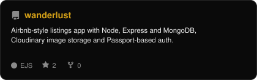

 

 

<code><a href="https://yashs.online">yashs.online</a></code> &nbsp;·&nbsp;
<code><a href="mailto:yashawasthi854@gmail.com">Email</a></code> &nbsp;·&nbsp;
<code><a href="https://www.linkedin.com/in/yash-awasthi-a7aa5b334">LinkedIn</a></code> &nbsp;·&nbsp;
<code><a href="https://www.instagram.com/yash.awasthi.10">Instagram</a></code>

  

 

## the short version

I'm in my final year of CSE (AI & ML) at BBDITM Lucknow, and most of what's in this repo comes from actually trying to ship things rather than just studying them. I started with the usual — data cleaning, a few Kaggle notebooks, model after model chasing a better score — but the part that stuck with me was always what happens *after* the model works: wrapping it in something a person can actually open and use. That's the thread running through everything below — a heart-risk model isn't worth much sitting in a notebook, so it's sitting in a Streamlit app instead. A photography portfolio isn't a landing page, it's a real admin panel a real photographer logs into every week.

Right now I'm deep in placement season, so if you're hiring for anything AI/ML or backend-shaped — my inbox is open.

 

---

### what I actually build with

Not going to list every tool I've ever touched — here's what I reach for most:

  

Python and Scikit-learn for the modeling side, FastAPI and Django for anything that needs a real backend, Next.js/React on the frontend, and plain HTML/CSS/JS when a project doesn't need a framework's overhead to look good.

---

### where this is all happening

I'm finishing up a B.Tech in Computer Science Engineering (AI & ML) at BBDITM, Lucknow — batch of 2027, currently in my final year.

---

### `skill --radar`

  <picture>
    <source media="(prefers-color-scheme: dark)" srcset="assets/radar-dark.svg">
    <source media="(prefers-color-scheme: light)" srcset="assets/radar-light.svg">
    
  </picture>
  <picture>
    <source media="(prefers-color-scheme: dark)" srcset="assets/radar-langs-dark.svg">
    <source media="(prefers-color-scheme: light)" srcset="assets/radar-langs-light.svg">
    
  </picture>

---

### `github --stats`

  <picture>
    <source media="(prefers-color-scheme: dark)" srcset="assets/card-stats-dark.svg">
    <source media="(prefers-color-scheme: light)" srcset="assets/card-stats-light.svg">
    
  </picture>

  

  

---

### `contribution --calendar`

  

  <picture>
    <source media="(prefers-color-scheme: dark)" srcset="https://raw.githubusercontent.com/Yashdotin/Yashdotin/output/github-contribution-grid-snake-dark.svg">
    <source media="(prefers-color-scheme: light)" srcset="https://raw.githubusercontent.com/Yashdotin/Yashdotin/output/github-contribution-grid-snake.svg">
    
  </picture>

---

### `selected --work`

<table>
<tr>
<td width="50%">
  <a href="https://github.com/Yashdotin/kriya">
    <picture>
      <source media="(prefers-color-scheme: dark)" srcset="assets/card-kriya-dark.svg">
      <source media="(prefers-color-scheme: light)" srcset="assets/card-kriya-light.svg">
      
    </picture>
  </a>
</td>
<td width="50%">
  <a href="https://github.com/Yashdotin/Aptivio">
    <picture>
      <source media="(prefers-color-scheme: dark)" srcset="assets/card-Aptivio-dark.svg">
      <source media="(prefers-color-scheme: light)" srcset="assets/card-Aptivio-light.svg">
      
    </picture>
  </a>
</td>
</tr>
<tr>
<td width="50%">
  <a href="https://github.com/Yashdotin/neural-nitpicker">
    <picture>
      <source media="(prefers-color-scheme: dark)" srcset="assets/card-neural-nitpicker-dark.svg">
      <source media="(prefers-color-scheme: light)" srcset="assets/card-neural-nitpicker-light.svg">
      
    </picture>
  </a>
</td>
<td width="50%">
  <a href="https://github.com/Yashdotin/wanderlust">
    <picture>
      <source media="(prefers-color-scheme: dark)" srcset="assets/card-wanderlust-dark.svg">
      <source media="(prefers-color-scheme: light)" srcset="assets/card-wanderlust-light.svg">
      
    </picture>
  </a>
</td>
</tr>
</table>

| project | live | stack |
|---|---|---|
| **[Kriya AI](https://github.com/Yashdotin/kriya)** | [kriya-ai-neon.vercel.app](https://kriya-ai-neon.vercel.app) | `FastAPI` `Next.js` `sentence-transformers` |
| **[Aptivio](https://github.com/Yashdotin/Aptivio)** | [aptivio-aura.vercel.app](https://aptivio-aura.vercel.app) | `FastAPI` `Next.js` `TF-IDF` |
| **[Neural Nitpicker](https://github.com/Yashdotin/neural-nitpicker)** | — | `React` `Node.js` `Gemini` |
| **[Wanderlust](https://github.com/Yashdotin/wanderlust)** | — | `Node.js` `Express` `MongoDB` |

---

### `connect --with-me`

  <code><a href="mailto:yashawasthi854@gmail.com">Email</a></code> &nbsp;·&nbsp;
  <code><a href="https://www.linkedin.com/in/yash-awasthi-a7aa5b334">LinkedIn</a></code> &nbsp;·&nbsp;
  <code><a href="https://www.instagram.com/yash.awasthi.10">Instagram</a></code> &nbsp;·&nbsp;
  <code><a href="https://yashs.online">Portfolio</a></code>

<i>"There are only two hard things in Computer Science: cache invalidation, naming things, and off-by-one errors."</i>

